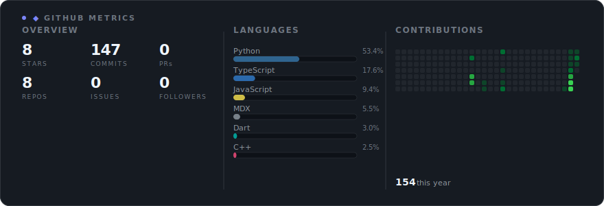

<picture>
  <source media="(prefers-color-scheme: dark)" srcset="assets/hero-dark.svg">
  <source media="(prefers-color-scheme: light)" srcset="assets/hero-light.svg">
  
</picture>

 
 

I build full-stack software: a real-time IoT platform that streams sensor data over MQTT into PostgreSQL and a live React dashboard, a link shortener running in production on Render, and a Flutter app that parses Hinglish messages into deadlines.

I'm also an Electronics &amp; Communication Engineering student in India — which is why the same portfolio reaches down to ESP8266 firmware and a RISC-V CPU implemented in Verilog. Understanding the layer below makes you better at the layer above.

The newest is [Kairyo](https://github.com/sahiljo14/Kairyo) — a desktop app that upscales manga and anime with AI super-resolution models, built with PyQt6 and PyTorch.

 

### Featured work

<a href="https://github.com/sahiljo14/Envirosense">
  <picture>
    <source media="(prefers-color-scheme: dark)" srcset="assets/cards/envirosense-dark.svg">
    <source media="(prefers-color-scheme: light)" srcset="assets/cards/envirosense-light.svg">
    
  </picture>
</a>

<a href="https://github.com/sahiljo14/nudge-app">
  <picture>
    <source media="(prefers-color-scheme: dark)" srcset="assets/cards/nudge-dark.svg">
    <source media="(prefers-color-scheme: light)" srcset="assets/cards/nudge-light.svg">
    
  </picture>
</a>

<a href="https://github.com/sahiljo14/riscv-single-cycle-processor">
  <picture>
    <source media="(prefers-color-scheme: dark)" srcset="assets/cards/riscv-dark.svg">
    <source media="(prefers-color-scheme: light)" srcset="assets/cards/riscv-light.svg">
    
  </picture>
</a>

<a href="https://github.com/sahiljo14/Kairyo">
  <picture>
    <source media="(prefers-color-scheme: dark)" srcset="assets/cards/kairyo-dark.svg">
    <source media="(prefers-color-scheme: light)" srcset="assets/cards/kairyo-light.svg">
    
  </picture>
</a>

 

### Activity

<picture>
  <source media="(prefers-color-scheme: dark)" srcset="assets/stats/dashboard-dark.svg">
  <source media="(prefers-color-scheme: light)" srcset="assets/stats/dashboard-light.svg">
  
</picture>

 

### More projects

| Repository | Description | |
| :--- | :--- | :--- |
| **[url-shortener](https://github.com/sahiljo14/url-shortener)** | Link shortener with click tracking, built on Node.js, Express, and MongoDB Atlas — [live on Render](https://url-shortener-vtz9.onrender.com) | JavaScript |
| **[esp8266-weather-station](https://github.com/sahiljo14/esp8266-weather-station)** | Temperature, humidity, and pressure on a 16×2 LCD and the Blynk app, with deep-sleep firmware for low power | Embedded C |
| **[sahilsportfolio](https://github.com/sahiljo14/sahilsportfolio)** | Portfolio site, hand-written HTML/CSS/JS — [sahiljo14.github.io/sahilsportfolio](https://sahiljo14.github.io/sahilsportfolio/) | HTML / CSS |

 

### Stack

Everything here appears in a repository above.

| | |
| :--- | :--- |
| **Languages** | JavaScript · Python · Java · Dart · C / C++ · Verilog |
| **Frontend** | React · Flutter · HTML / CSS |
| **Backend** | Node.js · Express · REST APIs · MQTT |
| **Databases** | PostgreSQL · MongoDB Atlas · SQLite |
| **Hardware** | ESP8266 / ESP32 · Arduino · DHT &amp; BMP sensors |
| **Tools** | Git &amp; GitHub · Render · Vivado / ModelSim · MATLAB · Altium Designer |

 

### Connect

| | |
| :--- | :--- |
| GitHub | [@sahiljo14](https://github.com/sahiljo14) |
| LeetCode | [leetcode.com/u/sahiljo](https://leetcode.com/u/sahiljo/) |
| Portfolio | [sahiljo14.github.io/sahilsportfolio](https://sahiljo14.github.io/sahilsportfolio/) |

<a href="https://ko-fi.com/sahiljo">
  <picture>
    <source media="(prefers-color-scheme: dark)" srcset="assets/kofi-dark.svg">
    <source media="(prefers-color-scheme: light)" srcset="assets/kofi-light.svg">
    
  </picture>
</a>

 

  India — building in the open.

